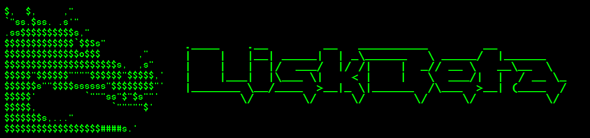

# Switch Validator/Generator Active Node

Please refers to official documentation [here](https://lisk.com/documentation/beta/run-blockchain/enable-block-generation.html#safely-enabling-block-generation-on-another-node).

This guide assume the target server was already prepared using the [guide](./PrepareGeneratorBackupNode.md).

If the first server is dead or corrupted, don't use this guide and go directly to full documentation.

This guide "bypass" export/import of GeneratorInfo file(s) from "prepared" server to "prepared" server. I'm not responsible for ANY problems. ;)

## Required LiskBeta4 Scripts

* lisk-core4-show-generator-info.sh
* lisk-core4-show-generator-import-cmd.sh

See [Download/Install LiskBeta4 Scripts](./InstallLiskCore.md#downloadinstall-liskbeta4-scripts) for install instructions.

## TODO

