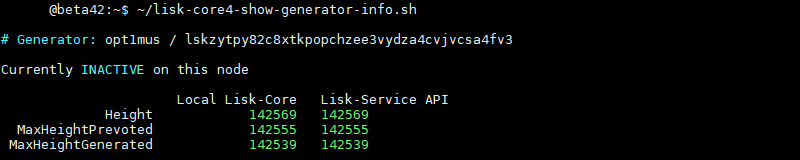

# Switch Validator/Generator Active Node

It is generally recommended to at least understand the process before using this kind of guide, the official documentation is [here](https://lisk.com/documentation/beta/run-blockchain/enable-block-generation.html#safely-enabling-block-generation-on-another-node).

If the first server is dead or corrupted, don't use this guide and go directly to official [documentation](https://lisk.com/documentation/beta/run-blockchain/enable-block-generation.html#safely-enabling-block-generation-on-another-node).

This guide "bypass" export/import of GeneratorInfo file(s) from "prepared" server to "prepared" server. I'm not responsible for ANY problems. ;)

## Requirements

The "destination"" server is already prepared.

If it's not already prepared, start with this [guide](./PrepareGeneratorBackupNode.md) first.

The following scripts must be installed on both servers:

* lisk-core4-show-generator-info.sh
* lisk-core4-show-generator-import-cmd.sh
* lisk-core4-enable-generator.sh *(Optional, auto-detect validator(s) address)*
* lisk-core4-disable-generator.sh *(Optional, auto-detect validator(s) address)*

See [Download/Install LiskBeta4 Scripts](./InstallLiskCore.md#downloadinstall-liskbeta4-scripts) for install instructions.

## Guide

For clarity, 'Server 1' is the initial active node and 'Server 2' the final active node.

For this example, we will switch ACTIVE node for `opt1mus / lskzytpy82c8xtkpopchzee3vydza4cvjvcsa4fv3`

1. Open SSH on both servers.

2. **Server 1**: Disable Generator
```shell
# Script
~/lisk-core4-disable-generator.sh
```
```shell
# lisk-core cmd
lisk-core generator:disable "lskzytpy82c8xtkpopchzee3vydza4cvjvcsa4fv3"
```


3. **Server 1**: Show Current Generator Info Status
  * Confirm the generator is currently INACTIVE.
  * Make sure the 'Local Lisk-Core' values are all GREEN.
```shell
~/lisk-core4-show-generator-info.sh
```


4. **Server 1**: Create Generator Info Import CMD
```shell
~/lisk-core4-show-generator-import-cmd.sh
```


5. **Server 2**: (Optional) Show Current Generator Info Status
  * The 'Local Lisk-Core' values are currently RED.
```shell
~/lisk-core4-show-generator-info.sh
```


6. **Server 2**: Update Generator Info
Copy the part between the green lines of the output of step 4 (on server 1).
Paste it directly in terminal of server 2.

7. **Server 2**: Show Current Generator Info Status
  * Make sure the 'Local Lisk-Core' values are now all GREEN.
```shell
~/lisk-core4-show-generator-info.sh
```


8. **Server 2**: Enable Generator
```shell
# Script
~/lisk-core4-enable-generator.sh
```
```shell
# lisk-core cmd
generator:enable lskzytpy82c8xtkpopchzee3vydza4cvjvcsa4fv3 --use-status-value
```


9. **Server 2**: (Optional) Show Current Generator Info Status
  * Confirm the generator is currently ACTIVE.
```shell
~/lisk-core4-show-generator-info.sh
```
Output Example: 

10. Close SSH on both servers.
